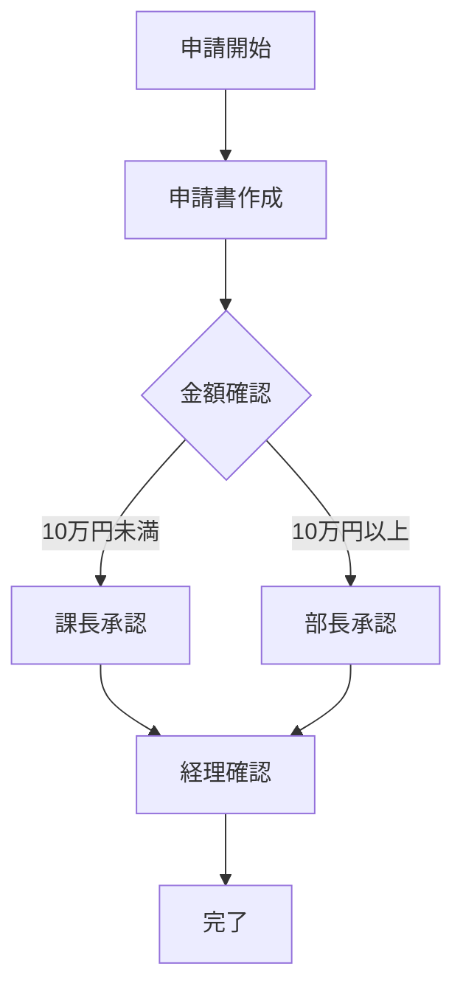

# NotebookLM Enterprise Experiments Python

このプロジェクトは**ドメイン駆動設計（DDD: Domain-Driven Design）**の原則に基づいて構成されています。

## プロジェクト構造

```
.
├── scripts/                 # 検証・ユーティリティスクリプト
│   ├── verify_qa.py         # Vertex AI Search 動作検証
│   ├── generate_slides.py   # スライド構成案（Marp Markdown）生成
│   └── generate_infographic.py  # 図解（Mermaid.js）生成
├── tests/                   # テストコード
└── notebooklm_enterprise_experiments_py/
    ├── domain/              # ドメインレイヤー
    │   ├── entities/        # エンティティ（一意の識別子を持つドメインオブジェクト）
    │   ├── value_objects/   # 値オブジェクト（識別子を持たない不変のドメインオブジェクト）
    │   ├── repositories/    # リポジトリインターフェース（永続化の抽象化）
    │   └── services/        # ドメインサービス（エンティティに属さないドメインロジック）
    ├── application/         # アプリケーションレイヤー
    │   ├── services/        # アプリケーションサービス（ユースケースの実装）
    │   └── dto/             # データ転送オブジェクト（レイヤー間のデータ転送）
    ├── infrastructure/      # インフラストラクチャレイヤー
    │   ├── config/          # 設定管理（環境変数など）
    │   ├── repositories/    # リポジトリ実装（ドメインリポジトリの具体的な実装）
    │   └── external/        # 外部サービス連携（GCPなど）
    └── interfaces/          # インターフェースレイヤー
        └── search_interface.py  # 検索サービスインターフェース
```

### レイヤーの責務

- **Domain（ドメイン）**: ビジネスロジックとドメインモデル。他のレイヤーに依存しない。
- **Application（アプリケーション）**: ユースケースの実装。ドメインレイヤーに依存する。
- **Infrastructure（インフラストラクチャ）**: 技術的な実装（データベース、外部API、設定など）。ドメインとアプリケーションに依存する。
- **Interfaces（インターフェース）**: 外部との接点（API、CLI、UIなど）。他のすべてのレイヤーに依存する。

## セットアップ

### 環境変数の設定

シークレットな情報（GCPのプロジェクトIDなど）は環境変数で管理します。

1. `.env.example`をコピーして`.env`ファイルを作成してください：
   ```bash
   cp .env.example .env
   ```

2. `.env`ファイルを編集して、実際の値を設定してください：
   ```env
   GCP_PROJECT_ID=your-actual-project-id
   ```

3. `.env`ファイルは自動的に`.gitignore`に含まれているため、Gitにコミットされることはありません。

### 環境変数の使用方法

コード内で環境変数を使用する場合は、`notebooklm_enterprise_experiments_py.infrastructure.config`モジュールを使用してください：

```python
from notebooklm_enterprise_experiments_py.infrastructure.config import (
    get_gcp_project_id,
    get_gcp_region,
)

# GCPプロジェクトIDを取得
project_id = get_gcp_project_id()

# GCPリージョンを取得（デフォルト: us-central1）
region = get_gcp_region()
```

利用可能な関数：
- `get_gcp_project_id()`: GCPプロジェクトIDを取得（必須）
- `get_gcp_region(default="us-central1")`: GCPリージョンを取得
- `get_gcp_location(default="global")`: GCPロケーションを取得
- `get_engine_id()`: Vertex AI Search Engine IDを取得
- `get_gemini_model(default="gemini-2.5-flash")`: Geminiモデル名を取得
- `get_env(key, default=None)`: 任意の環境変数を取得

## スクリプトの実行

### Vertex AI Search 動作検証スクリプト

`scripts/verify_qa.py` は、Vertex AI Search (Discovery Engine) の動作を検証するスクリプトです。

#### 前提条件

1. GCPコンソールで検索アプリ（Engine）とデータストアがセットアップ済みであること
2. サービスアカウントキーが設定されていること

#### 環境変数の設定

`.env` ファイルに以下の環境変数を設定してください：

```env
# 必須
GCP_PROJECT_ID=your-project-id
ENGINE_ID=your-engine-id

# オプション（デフォルト: global）
LOCATION=global

# Geminiモデル（デフォルト: gemini-2.5-flash）
GEMINI_MODEL=gemini-2.5-flash

# 認証情報（いずれかを設定）
GCP_SERVICE_ACCOUNT_KEY_PATH=credentials/service-account.json
# または
GCP_SERVICE_ACCOUNT_KEY_JSON={"type": "service_account", ...}
```

#### 実行方法

```bash
# 1. uv 環境の有効化（初回のみ依存関係をインストール）
uv sync

# 2. 仮想環境を有効化
source .venv/bin/activate

# 3. スクリプトを実行（デフォルトの質問）
python scripts/verify_qa.py

# 4. カスタムの質問で実行
python scripts/verify_qa.py "質問内容をここに記述"
```

または、`uv run` を使用して直接実行することもできます：

```bash
# デフォルトの質問で実行
uv run python scripts/verify_qa.py

# カスタムの質問で実行
uv run python scripts/verify_qa.py "ドキュメントに関する具体的な質問"
```

#### 出力例

```
============================================================
Vertex AI Search (Discovery Engine) 動作検証
============================================================

プロジェクトID: your-project-id
Engine ID: your-engine-id
ロケーション: global

VertexAISearchService を初期化中...
初期化完了

質問: このデータストアにあるドキュメントの概要を教えてください
------------------------------------------------------------

【AIの回答】
（AIによって生成された回答が表示されます）

【参照ドキュメント】
  1. ドキュメントタイトル
     URL: https://drive.google.com/...

============================================================
検証完了
============================================================
```

### スライド生成スクリプト

`scripts/generate_slides.py` は、検索結果を元にプレゼンテーション用のスライド構成を生成するスクリプトです。

#### 機能

- Vertex AI Searchで関連ドキュメントを検索
- Gemini Proを使用してMarp互換のMarkdown形式でスライド構成を生成
- 5〜8枚程度のスライドに自動でまとめる

#### 実行方法

```bash
# 基本的な使い方
uv run python scripts/generate_slides.py "新入社員向けのセキュリティ研修資料を作って"

# 出力ファイル名を指定
uv run python scripts/generate_slides.py "検索クエリ" --output my_slides.md

# 使用するGeminiモデルを指定
uv run python scripts/generate_slides.py "検索クエリ" --model gemini-2.5-pro
```

#### コマンドラインオプション

| オプション | 説明 | デフォルト |
|-----------|------|-----------|
| `query` | 検索クエリ（必須） | - |
| `--output`, `-o` | 出力ファイル名 | `output_slides.md` |
| `--model`, `-m` | 使用するGeminiモデル | 環境変数または `gemini-2.5-flash` |

#### 出力例

```markdown
---
marp: true
theme: default
paginate: true
---

# セキュリティ研修資料

概要テキスト

---

## セクション1

- ポイント1
- ポイント2

---
```

生成されたMarkdownファイルは、VS Code + Marp拡張機能でプレビュー・PDF出力できます。

### 図解生成スクリプト

`scripts/generate_infographic.py` は、検索結果を元にMermaid.js形式の図解を生成するスクリプトです。

#### 機能

- Vertex AI Searchで関連ドキュメントを検索
- Gemini Proを使用してMermaid.js形式の図解コードを生成
- フローチャート、シーケンス図、マインドマップなど複数の図形式をサポート

#### 実行方法

```bash
# フローチャートを生成（デフォルト）
uv run python scripts/generate_infographic.py "稟議申請のフローチャートを作って"

# シーケンス図を生成
uv run python scripts/generate_infographic.py "APIの呼び出し順序を図解して" --type sequence

# マインドマップを生成
uv run python scripts/generate_infographic.py "プロジェクトの構成を図解して" --type mindmap

# 出力ファイル名を指定
uv run python scripts/generate_infographic.py "検索クエリ" --output my_diagram.md
```

#### コマンドラインオプション

| オプション | 説明 | デフォルト |
|-----------|------|-----------|
| `query` | 検索クエリ（必須） | - |
| `--type`, `-t` | 図の種類 | `flowchart` |
| `--output`, `-o` | 出力ファイル名 | `output_diagram.md` |
| `--model`, `-m` | 使用するGeminiモデル | 環境変数または `gemini-2.5-flash` |

#### サポートする図の種類

| タイプ | 説明 |
|--------|------|
| `flowchart` | フローチャート |
| `sequence` | シーケンス図 |
| `mindmap` | マインドマップ |
| `classDiagram` | クラス図 |
| `stateDiagram` | 状態遷移図 |
| `erDiagram` | ER図 |
| `gantt` | ガントチャート |

#### 出力例

```markdown

```

生成されたMermaidコードは以下の方法でプレビューできます：
- VS Code + Mermaid拡張機能
- GitHub/GitLabのMarkdownプレビュー
- [Mermaid Live Editor](https://mermaid.live/)

## 開発ガイドライン

### DDDの原則に従った開発

1. **ドメインモデルを中心に設計する**: ビジネスロジックはドメインレイヤーに配置する
2. **依存関係の方向を守る**: ドメイン → アプリケーション → インフラストラクチャ → インターフェースの順に依存する
3. **リポジトリパターンを使用**: 永続化の詳細はインフラストラクチャレイヤーに隠蔽する
4. **値オブジェクトとエンティティを適切に使い分ける**: 識別子が必要な場合はエンティティ、不要な場合は値オブジェクト
