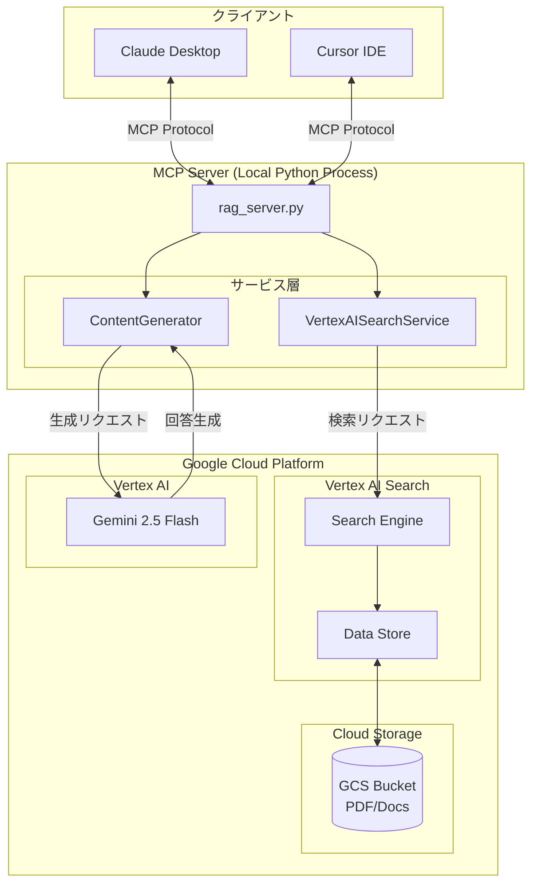
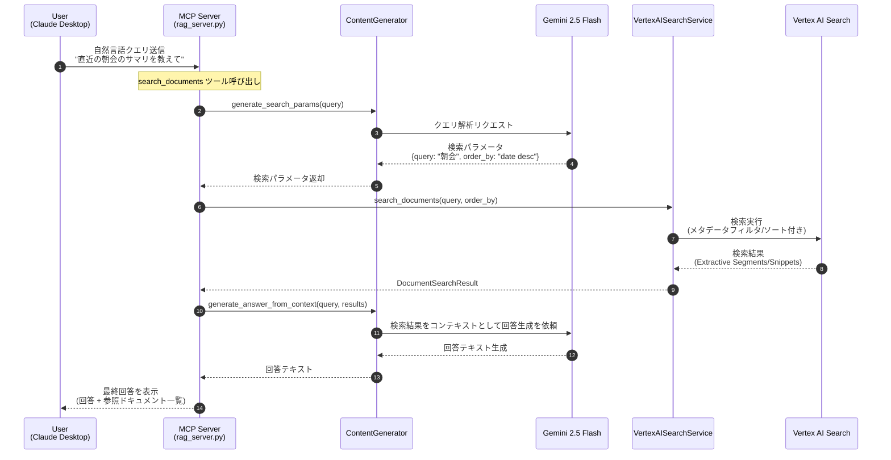

# NotebookLM Enterprise Experiments Python

社内ドキュメント検索とコンテンツ生成を行うMCPサーバーです。Vertex AI SearchとGeminiを組み合わせたRAG（Retrieval-Augmented Generation）システムを提供します。

## システム構成図



## プロジェクト構造

```
.
├── servers/                 # MCPサーバー
│   └── rag_server.py        # メインのMCPサーバー実装
├── scripts/                 # ユーティリティスクリプト
│   ├── verify_qa.py         # Vertex AI Search 動作検証
│   ├── generate_slides.py   # スライド構成案（Marp Markdown）生成
│   ├── generate_infographic.py  # 図解（Mermaid.js）生成
│   └── generate_metadata.py # GCSメタデータ生成
├── tests/                   # テストコード
├── docs/                    # ドキュメント
│   └── ARCHITECTURE.md      # 詳細なアーキテクチャ説明
└── notebooklm_enterprise_experiments_py/
    ├── config/              # 設定管理（環境変数など）
    │   └── env_config.py
    ├── services/            # サービス層
    │   ├── content_generator.py      # Geminiコンテンツ生成
    │   └── vertex_ai_search_service.py  # Vertex AI Search
    └── models/              # データモデル
        └── search.py        # 検索関連のデータクラス
```

## MCPサーバー

### 提供するツール

| ツール名 | 説明 |
|---------|------|
| `search_documents` | 社内ドキュメントを検索し、Geminiで回答を生成 |
| `generate_slide_draft` | 検索結果を元にMarp形式のスライド構成を生成 |
| `generate_diagram` | 検索結果を元にMermaid形式の図解を生成 |

### 起動方法

```bash
uv run python servers/rag_server.py
```

## セットアップ

### 環境変数の設定

シークレットな情報（GCPのプロジェクトIDなど）は環境変数で管理します。

1. `.env.example`をコピーして`.env`ファイルを作成してください：
   ```bash
   cp .env.example .env
   ```

2. `.env`ファイルを編集して、実際の値を設定してください：
   ```env
   # 必須
   GCP_PROJECT_ID=your-project-id
   ENGINE_ID=your-engine-id

   # オプション（デフォルト: global）
   LOCATION=global

   # Geminiモデル（デフォルト: gemini-2.5-flash）
   GEMINI_MODEL=gemini-2.5-flash

   # 認証情報（いずれかを設定）
   GCP_SERVICE_ACCOUNT_KEY_PATH=credentials/service-account.json
   # または
   GCP_SERVICE_ACCOUNT_KEY_JSON={"type": "service_account", ...}
   ```

3. `.env`ファイルは自動的に`.gitignore`に含まれているため、Gitにコミットされることはありません。

### 環境変数の使用方法

コード内で環境変数を使用する場合は、`notebooklm_enterprise_experiments_py.config`モジュールを使用してください：

```python
from notebooklm_enterprise_experiments_py.config import (
    get_gcp_project_id,
    get_gcp_region,
)

# GCPプロジェクトIDを取得
project_id = get_gcp_project_id()

# GCPリージョンを取得（デフォルト: us-central1）
region = get_gcp_region()
```

利用可能な関数：
- `get_gcp_project_id()`: GCPプロジェクトIDを取得（必須）
- `get_gcp_region(default="us-central1")`: GCPリージョンを取得
- `get_gcp_location(default="global")`: GCPロケーションを取得
- `get_engine_id()`: Vertex AI Search Engine IDを取得
- `get_gemini_model(default="gemini-2.5-flash")`: Geminiモデル名を取得
- `get_env(key, default=None)`: 任意の環境変数を取得

## スクリプトの実行

### Vertex AI Search 動作検証スクリプト

```bash
# デフォルトの質問で実行
uv run python scripts/verify_qa.py

# カスタムの質問で実行
uv run python scripts/verify_qa.py "ドキュメントに関する具体的な質問"
```

### スライド生成スクリプト

```bash
# 基本的な使い方
uv run python scripts/generate_slides.py "新入社員向けのセキュリティ研修資料を作って"

# 出力ファイル名を指定
uv run python scripts/generate_slides.py "検索クエリ" --output my_slides.md

# 使用するGeminiモデルを指定
uv run python scripts/generate_slides.py "検索クエリ" --model gemini-2.5-pro
```

### 図解生成スクリプト

```bash
# フローチャートを生成（デフォルト）
uv run python scripts/generate_infographic.py "稟議申請のフローチャートを作って"

# シーケンス図を生成
uv run python scripts/generate_infographic.py "APIの呼び出し順序を図解して" --type sequence

# マインドマップを生成
uv run python scripts/generate_infographic.py "プロジェクトの構成を図解して" --type mindmap
```

#### サポートする図の種類

| タイプ | 説明 |
|--------|------|
| `flowchart` | フローチャート |
| `sequence` | シーケンス図 |
| `mindmap` | マインドマップ |
| `classDiagram` | クラス図 |
| `stateDiagram` | 状態遷移図 |
| `erDiagram` | ER図 |
| `gantt` | ガントチャート |

## 処理シーケンス図

「ユーザーが『直近の朝会のサマリを教えて』と質問した際」の内部フロー：



## 開発ガイドライン

### 設計方針

- **Simple & Pragmatic**: 過剰な抽象化を避け、可読性の高いシンプルなコードを維持する
- **Type Hinting**: Pythonの型ヒントを厳密に記述する
- **Docstrings**: 各ツールやメソッドの入出力の説明を充実させる
- **GCP Integration**: Vertex AI SDK の最新の仕様に準拠する

### 開発コマンド

```bash
# Lintチェック
uv run ruff check .

# フォーマット
uv run ruff format .

# 型チェック
uv run pyright

# テスト実行
uv run pytest
```

## アーキテクチャの詳細

詳細なアーキテクチャ説明は [docs/ARCHITECTURE.md](docs/ARCHITECTURE.md) を参照してください。
