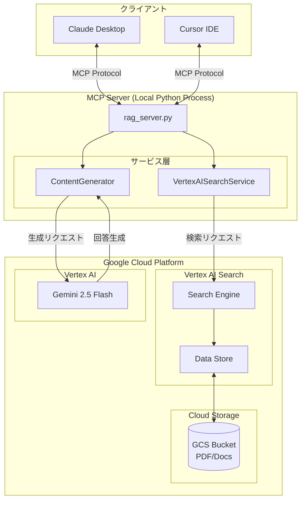
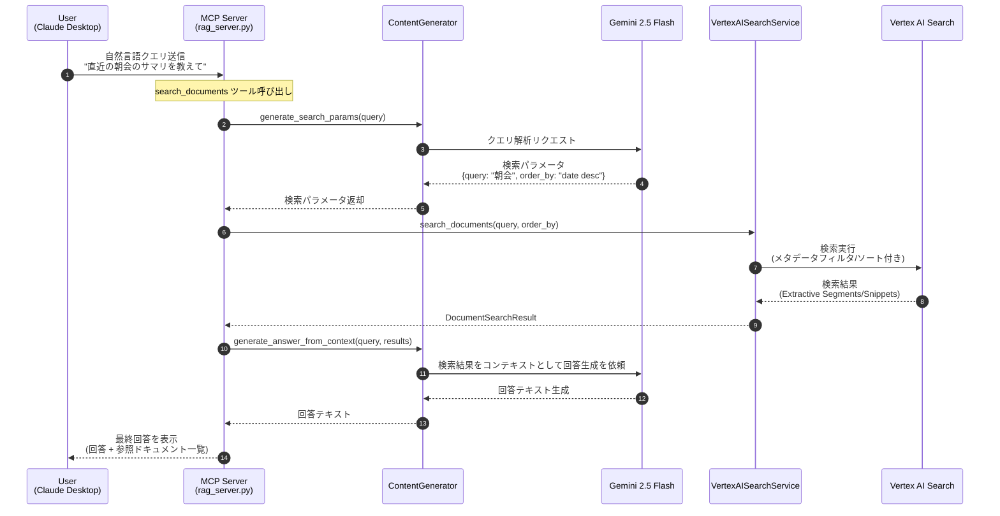

# アーキテクチャ

このドキュメントでは、NotebookLM Enterprise Experiments のシステム構成と処理フローを説明します。

## システム構成図



## コンポーネント説明

| コンポーネント | 役割 |
|---------------|------|
| **Claude Desktop / Cursor** | MCPプロトコルでサーバーと通信するAIクライアント |
| **rag_server.py** | MCPサーバー本体。3つのツールを公開 |
| **ContentGenerator** | Gemini APIを使用してコンテンツ生成（回答、スライド、図解） |
| **VertexAISearchService** | Vertex AI Search APIを使用して検索を実行 |
| **Vertex AI Search** | 社内ドキュメントのインデックスと検索エンジン |
| **Cloud Storage** | 検索対象ドキュメント（PDF、Googleドキュメント等）の保存場所 |
| **Gemini 2.5 Flash** | 回答生成、スライド生成、図解生成を行う生成AIモデル |

## 処理シーケンス図

「ユーザーが『直近の朝会のサマリを教えて』と質問した際」の内部フローを示します。



## 処理フロー詳細

### 1. クエリ解析フェーズ
- ユーザーの自然言語クエリをGeminiで解析
- 検索キーワード、日付フィルタ、ソート順を抽出
- 例: 「直近の朝会」→ `{query: "朝会", order_by: "date desc"}`

### 2. 検索フェーズ
- Vertex AI Search APIに検索リクエストを送信
- 抽出セグメント（Extractive Segments）を取得
- メタデータフィールド（date）でフィルタ/ソートを適用

### 3. 回答生成フェーズ
- 検索結果をコンテキストとしてGeminiに送信
- RAG（Retrieval-Augmented Generation）方式で回答を生成
- 参照元ドキュメントのタイトルとURLを含めて返却

## MCPツール一覧

| ツール名 | 説明 |
|---------|------|
| `search_documents` | 社内ドキュメントを検索し、Geminiで回答を生成 |
| `generate_slide_draft` | 検索結果を元にMarp形式のスライド構成を生成 |
| `generate_diagram` | 検索結果を元にMermaid形式の図解を生成 |

## ディレクトリ構造

```
.
├── servers/                 # MCPサーバー
│   └── rag_server.py
├── scripts/                 # ユーティリティスクリプト
│   ├── verify_qa.py
│   ├── generate_slides.py
│   ├── generate_infographic.py
│   └── generate_metadata.py
├── tests/                   # テストコード
└── notebooklm_enterprise_experiments_py/
    ├── config/              # 設定管理
    │   └── env_config.py
    ├── services/            # サービス層
    │   ├── content_generator.py
    │   └── vertex_ai_search_service.py
    └── models/              # データモデル
        └── search.py
```
